# VinceLJuice GTK/KDE Themes Repository

A comprehensive collection of GTK and KDE themes from [VinceLJuice](https://github.com/vinceliuice)

ALL credit (including screenshots), go to VinceLJuice

---

## GTK Themes

Themes for GTK 3, GTK 2 and Gnome-Shell, based envirnoments

- Gnome, Unity, Budgie, Pantheon, XFCE, Mate, etc.

### 1. Mojave GTK Theme

**Repository:** [https://github.com/vinceliuice/Mojave-gtk-theme](https://github.com/vinceliuice/Mojave-gtk-theme)

A Mac OSX-like theme

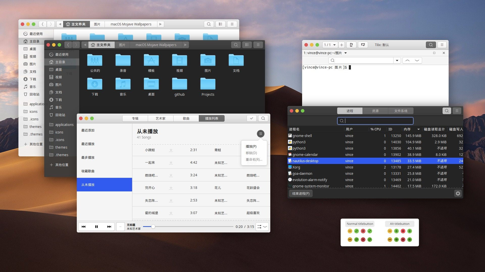

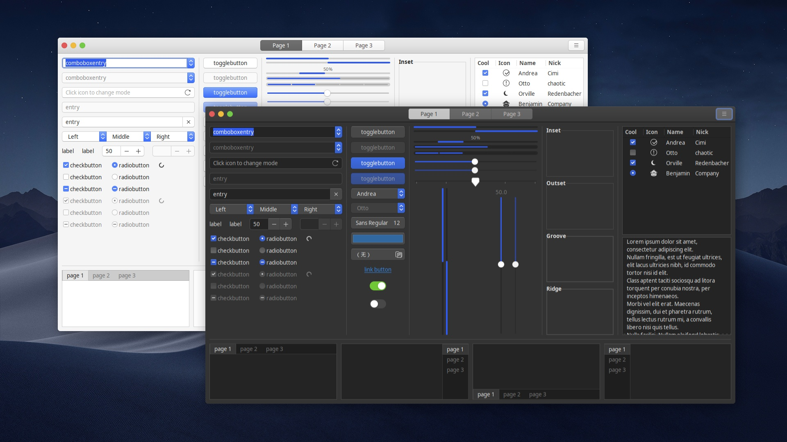

**McMojave KDE Theme:** [McMojave KDE Theme](https://github.com/vinceliuice/McMojave-kde)

---

### 2. MacTahoe GTK Theme

**Repository:** [MacTahoe GTK Theme](https://github.com/vinceliuice/MacTahoe-gtk-theme)

A macOS Tahoe-like theme

Based on: WhiteSur GTK Theme.

**MacTahoe KDE Theme:** [MacTahoe KDE Theme](https://github.com/vinceliuice/MacTahoe-kde)

---

### 3. Matcha GTK Theme

**Repository:** [Matcha GTK Theme](https://github.com/vinceliuice/Matcha-gtk-theme)

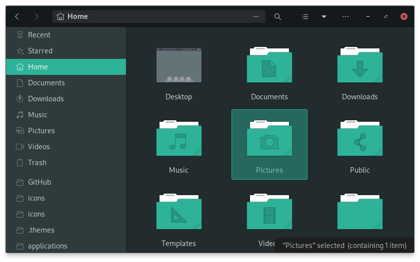

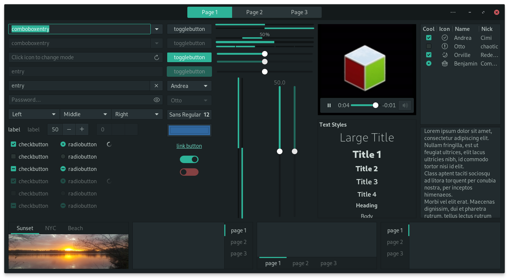

**Matcha KDE Theme:** [Matcha KDE Theme](https://github.com/vinceliuice/Matcha-kde)

---

### 4. Orchis Theme

**Repository:** [Orchis Theme](https://github.com/vinceliuice/Orchis-theme)

A Material Design theme, based on materia-theme.

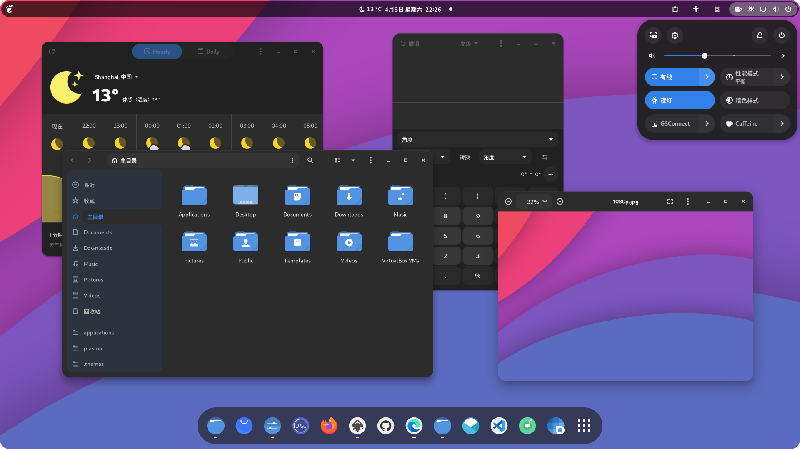

**Orchis KDE Theme:** [Orchis KDE Theme](https://github.com/vinceliuice/Orchis-kde)

---

### 5. Qogir GTK Theme

**Repository:** [https://github.com/vinceliuice/Qogir-theme](https://github.com/vinceliuice/Qogir-theme)

A flat Design theme

Based on Arc gtk theme.

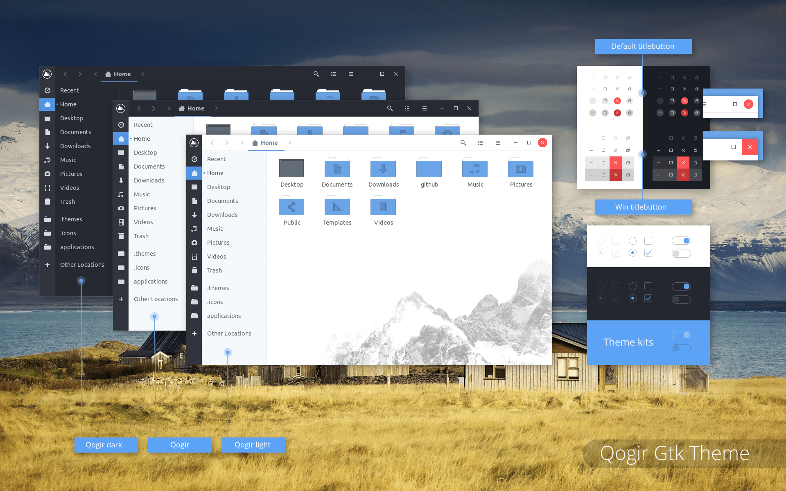

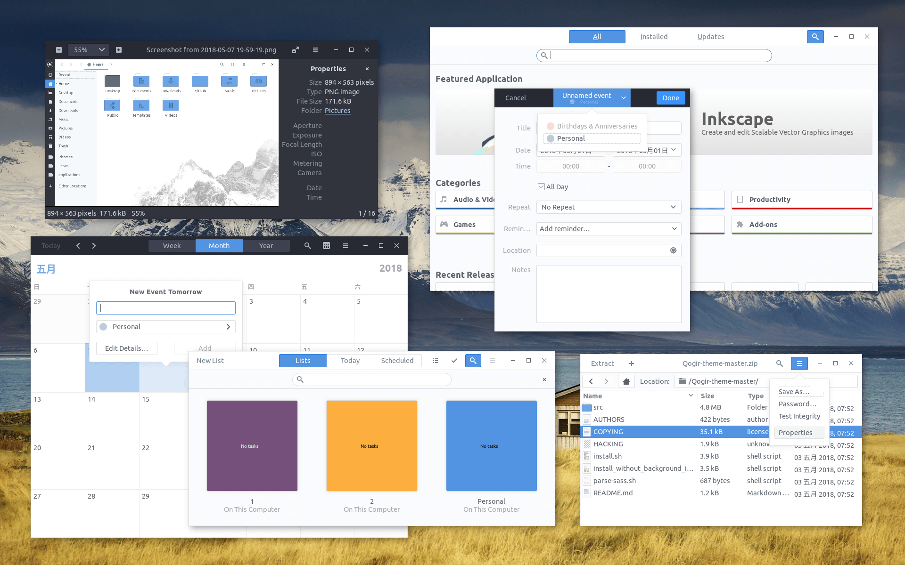

- **Qogir KDE Theme:** [Qogir KDE Theme](https://github.com/vinceliuice/Qogir-kde)

---

### 6. Vimix GTK Themes

**Repository:** [https://github.com/vinceliuice/Vimix-gtk-themes](https://github.com/vinceliuice/Vimix-gtk-themes)

A flat Material Design theme

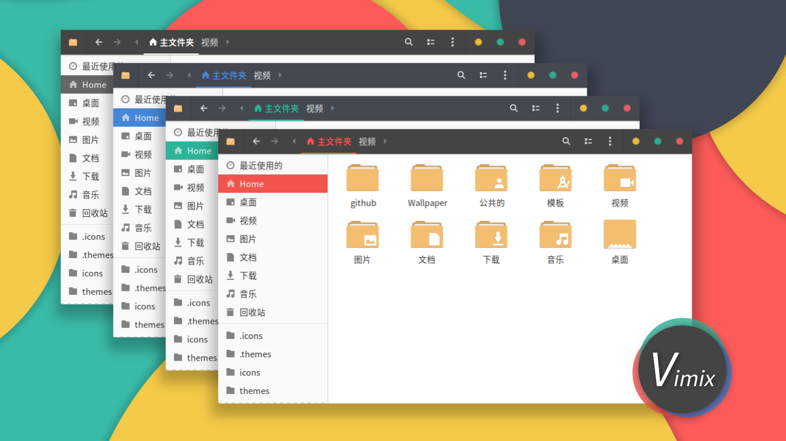

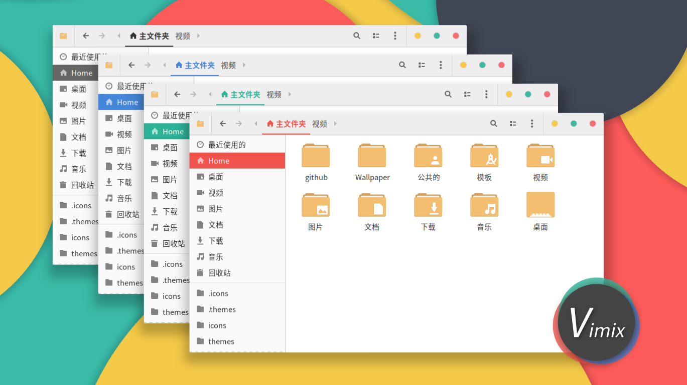

- **Vimix KDE Theme:** [Vimix KDE Theme](https://github.com/vinceliuice/Vimix-kde)

---

### 7. WhiteSur GTK Theme

**Repository:** [WhiteSur GTK Theme](https://github.com/vinceliuice/WhiteSur-gtk-theme)

A macOS-like theme for Linux GTK Desktops. Features modern and beautiful design.

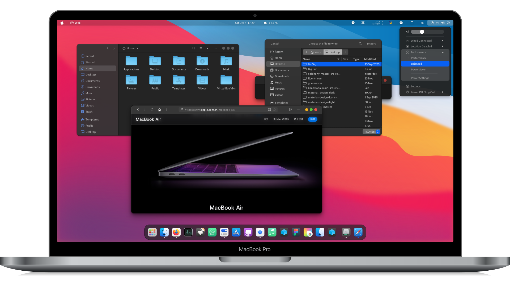

- **WhiteSur KDE Theme:** [WhiteSur KDE Theme](https://github.com/vinceliuice/WhiteSur-kde)

---

### 8. Layan GTK Theme

**Repository:** [Layan GTK Theme](https://github.com/vinceliuice/Layan-gtk-theme)

A flat Material Design theme

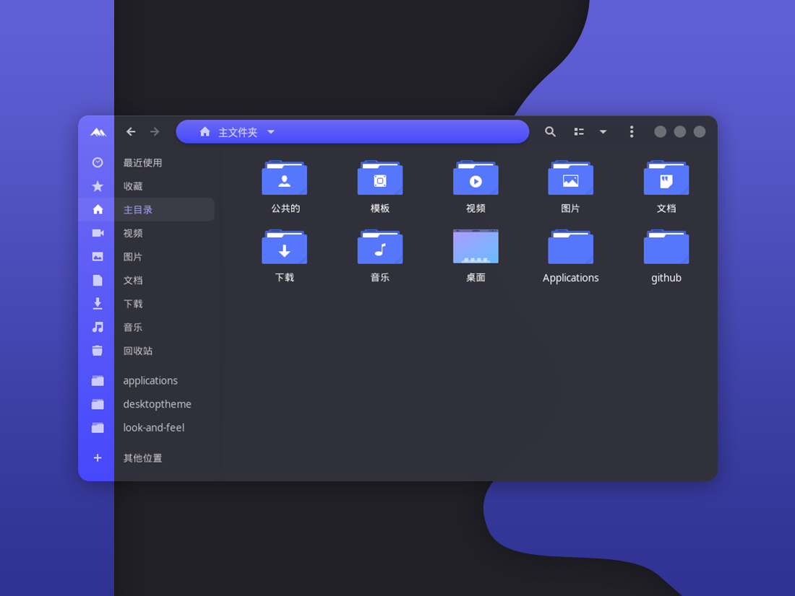

- **Layan KDE Theme:** [Layan KDE Theme](https://github.com/vinceliuice/Layan-kde)

---

### 9. Fluent GTK Theme

**Repository:** [Fluent GTK Theme](https://github.com/vinceliuice/Fluent-gtk-theme)

- **Fluent KDE Theme:** [Fluent KDE Theme](https://github.com/vinceliuice/Fluent-kde)

---

## Icon Themes

### Icon Theme Collections

- **McMojave Circle Icons:** [McMojave Circle Icons](https://github.com/vinceliuice/McMojave-circle)
- **Fluent Icon Theme:** [Fluent Icon Theme](https://github.com/vinceliuice/Fluent-icon-theme)
- **MacTahoe Icon Theme:** [MacTahoe Icon Theme](https://github.com/vinceliuice/MacTahoe-icon-theme)
- **Qogir Icon Theme:** [Qogir Icon Theme](https://github.com/vinceliuice/Qogir-icon-theme)
- **Vimix Icon Theme:** [Vimix Icon Theme](https://github.com/vinceliuice/Vimix-icon-theme)
- **WhiteSur Icon Theme:** [WhiteSur Icon Theme](https://github.com/vinceliuice/WhiteSur-icon-theme)

---

## Cursor Themes

### Cursor Theme Collections

- **Vimix Cursors:** [Vimix Cursors](https://github.com/vinceliuice/Vimix-cursors)
- **WhiteSur Cursors:** [WhiteSur Cursors](https://github.com/vinceliuice/WhiteSur-cursors)
- **Layan Cursors:** [Layan Cursors](https://github.com/vinceliuice/Layan-cursors)

---

## Featured Collections

### Flavor Variants

Each theme typically includes multiple options:

- **Color Variants:** Light, Dark, and Standard versions
- **Accent Colors:** Multiple color theme options
  - (blue, purple, pink, red, orange, yellow, green, grey, etc.)
- **Size Variants:** Standard and Compact versions
- **Effect Variants:** Transparency, blur, solid options

### Platform Support

All themes support:

- **GNOME/GTK:** Full support for GTK 3, GTK 2, and Gnome-Shell
- **KDE Plasma:** Dedicated KDE versions available
- **Flatpak:** Compatible with Flatpak applications
- **libadwaita:** Support for GTK 4 and libadwaita apps

---

## Installation

For each theme, the typical installation process is:

```bash
git clone https://github.com/vinceliuice/[THEME-NAME].git --depth=1
cd [THEME-NAME]
./install.sh
```

Refer to each repository's README for specific installation instructions and customization options.

---

## Author

All themes are created and maintained by **VinceLJuice** (Vince Liuice).

For more information and support, visit the individual repositories listed above.

---

*Last Updated: May 2, 2026*
